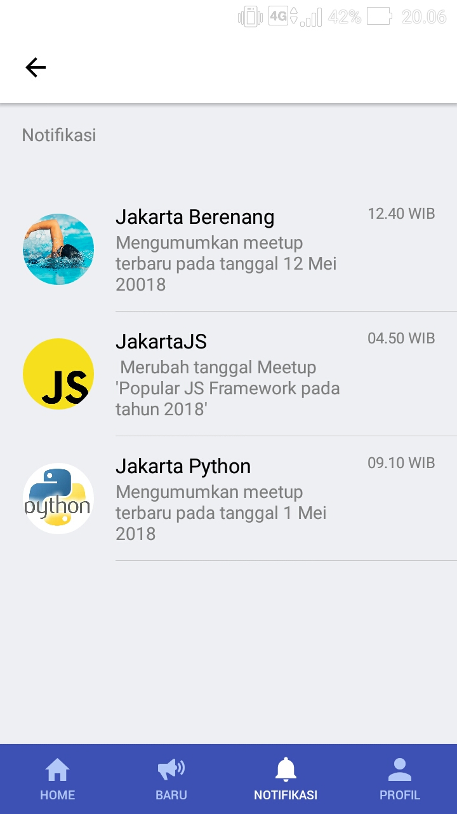

# Komunitas
It's similar to Meetup.com, but more simple. Build using react native, native base UI, and react navigation. 
In the near future, i would like to integrate this with Firebase as database.  

## Screenshots

Here are a few page screenshots of Komunitas app :

- [Sign Up](#sign-up)
- [Login](#login)
- [Home](#home)
- [WhatsNew](#whatsnew)
- [Notification](#notification)
- [Profile](#profile)
- [Search](#search)
- [New Group](#new-group)
- [Logout](#logout)

## Sign Up

## Login

## Home 

## WhatsNew 

## Notification

## Profile

## Search

## New Group

## Logout

This is not completed yet, so it might change anytime. 
